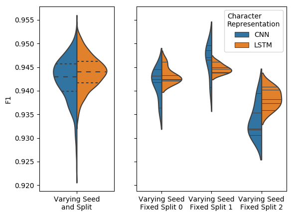

.. FIESTA documentation master file, created by
   sphinx-quickstart on Sun Jun  2 19:57:42 2019.
   You can adapt this file completely to your liking, but it should at least
   contain the root `toctree` directive.

FIESTA Documentation
====================
FIESTA (Fast IdEntification of State-of-The-Art) package as the name suggests 
allows you to easily find the **best model** from a set of models taking into 
account two sources of randomness **data splits** and **random seeds**.

This package is also 
flexible enough to only consider the **random seeds** and keep the **data 
splits** fixed which may be required for evaluation competitions like 
`SemEval <http://alt.qcri.org/semeval2019/index.php?id=tasks>`_.

FIESTA looks at two different model selection scenarios; **Fixed Budget** and 
**Fixed Confidence**.

#. :ref:`motivation-label`
#. :ref:`model-selection-scenarios-label`

   #. :ref:`fixed-budget-label`
   #. :ref:`fixed-confidence-label`

#. :ref:`installing-label`
#. :ref:`tutorials-label`
#. :ref:`package-label`
#. :ref:`indices-and-tables-label`

.. _motivation-label:

Motivation
==========
When comparing a set of models there are two sources of 
randomness/stochasticity:

1. The non-determinstic model's random seed choice during training which
   affects weight intialisation, data sub-sampling for SGD, and negative 
   sampling used to train word embeddings etc.
2. The data splits that the model was/is trained on.

It has already been shown in 
`Reimers and Gurevych, 2017 <https://www.aclweb.org/anthology/D17-1035>`_ 
that random seeds statistically significantly affect results. We further show 
in the `FIESTA paper (Moss et al. 2018) <https://arxiv.org/pdf/1906.12230.pdf>`_ 
that both of these need to be taken into account. This can be best seen below 
where the plots show the results of two different Named Entity Recogniser (NER)
models, where the left plot shows the results varying both data splits and 
random seeds, where as the right plot shows results with 3 different data splits 
and 5 different seeds.

As we can see from the right hand side plot, each plot is a different data split 
and each split has had the model evaluated 5 times with a different random seed.
The middle and far right plots clearly shows the CNN and LSTM models winning 
respectively where as the far left is kind of a draw. This should show why 
we need to take into account random seeds and data splits when evaluating 
our models.

Other relevant work
+++++++++++++++++++
`Reimers and Gurevych, 2018 <https://arxiv.org/pdf/1803.09578.pdf>`_ has already 
suggested that we should stop comparing models based on a single evaluation and 
should compare based on numerous evaluations so that we can take into account 
the random seed problem. This paper has some really good emprical reasons 
why. In the `FIESTA work <https://arxiv.org/pdf/1906.12230.pdf>`_ we don't 
take the assumption of fixed train, develoment and test splits as we 
show that this is another source of randomness. Further more we 
show two efficent adaptive approachs of finding the best model given a 
confidence score (`TTTS <./api/TTTS.html>`_) or budget 
(`Sequential Halving <./api/fiesta.sequential_halving.html>`_) compared 
to the standard non-adptive approaches like the one stated in 
`Reimers and Gurevych, 2018 <https://arxiv.org/pdf/1803.09578.pdf>`_.

`Gorman and Bedrick, 2019 <https://wellformedness.com/papers/gorman-bedrick-2019.pdf>`_
concurrently produced similar findings to those in the 
`FIESTA  work <https://arxiv.org/pdf/1906.12230.pdf>`_ with regards 
to taking data splits into account. They show that different data splits can 
cause the rankings of different POS tagger models to change compared to using 
the standard splits suggested for the POS datasets used. As stated eariler in 
the `FIESTA paper <https://arxiv.org/pdf/1906.12230.pdf>`_ we motivated 
the data splits using NER but now it has also been shown for POS 
tagging (both using English datasets).

The FIESTA package has two different ways of finding the best model taking 
into account the data split and random seed, :ref:`fixed-confidence-label` (FC) 
and :ref:`fixed-budget-label`. These are explained in more detail below and in the 
the package's documentation as well as in the FIESTA paper.

.. _model-selection-scenarios-label:

Model Selection Scenarios
=========================

.. _fixed-budget-label:

Fixed Budget (FB)
+++++++++++++++++

Problem
-------
.. include:: ./details/fb_problem.rst

Methods
-------

`fiesta.non_adaptive_fb <./api/fiesta.non_adaptive_fb.html>`_
#############################################################
.. include:: ./details/non_adaptive_fb_explaination.rst

`fiesta.sequential_halving <./api/fiesta.sequential_halving.html>`_
###################################################################
.. include:: ./details/sequential_halving_explaination.rst

For more details on this approach see the 
`Sequential Halving documentation <./api/fiesta.sequential_halving.html>`_.

.. include:: ./details/sequential_halving_note.rst

.. _fixed-confidence-label:

Fixed Confidence (FC)
+++++++++++++++++++++

Problem
-------
.. include:: ./details/fc_problem.rst

Methods
-------

`fiesta.non_adaptive_fc <./api/fiesta.non_adaptive_fc.html>`_
#############################################################
.. include:: ./details/non_adaptive_fc_explaination.rst

`fiesta.TTTS <./api/TTTS.html>`_
#############################################################
.. include:: ./details/ttts_explaination.rst

.. include:: ./details/ttts_note.rst

For more details on this approach see the 
`TTTS documentation <./api/fiesta.TTTS.html>`_.

.. _installing-label:

Installing
==========

Requires Python 3.6.1 or greater.

.. code-block:: bash 

    pip install fiesta-nlp

.. _tutorials-label:

Tutorials
=========
Each tutorial is a runnable Google Colab notebook.

1. `FIESTA paper replication <https://github.com/apmoore1/fiesta/blob/master/notebooks/Advantages_of_Model_Selection.ipynb>`_ 
   - Shows how to replicate the results from the 
   FIESTA paper using static data.
2. `Custom AllenNLP models <https://github.com/apmoore1/fiesta/blob/master/notebooks/TDSA_AllenNLP_Example.ipynb>`_ 
   - Shows how to use the Fixed Budget and Confidence 
   methods using Custom AllenNLP models, based around the tasks in the FIESTA 
   paper (Target Dependent Sentiment Analysis). Compared to the replication 
   tutorial the data is not static, very much a real world example. 

.. _package-label:

.. toctree::
    :maxdepth: 4
    :caption: Package Reference

    ./api/model_selectors
    ./api/fiesta.util

.. _indices-and-tables-label:

Indices and tables
==================

* :ref:`genindex`
* :ref:`modindex`
